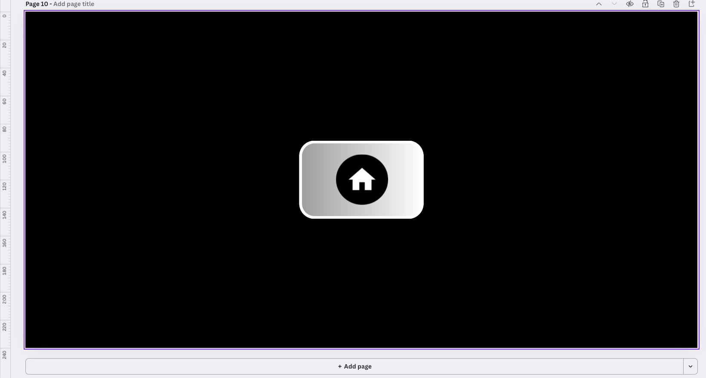

# API Reference - WinLib Interface Class (WLIC)

Complete API documentation for the WinLib Interface Class framework.

---

## Table of Contents

- [Interface Class](#interface-class)
  - [Constructors](#constructors)
  - [Constructor Examples](#constructor-examples)
  - [Public Methods](#public-methods)
  - [Protected Members](#protected-members)
- [Creating Your Own Interfaces](#creating-your-own-interfaces)
- [Button Coordinates](#button-coordinates)
- [Understanding Interface Hierarchy and Navigation](#understanding-interface-hierarchy-and-navigation)
- [Display Functions](#display-functions)
- [Utility Functions](#utility-functions)
- [Usage Examples](#usage-examples)

---

## Interface Class

The `Interface` class is the core component of the WLIC framework, providing a complete system for creating interactive touchscreen interfaces.

### Constructors

The Interface class provides multiple constructor overloads to support different feature combinations:

#### Basic Constructors

```cpp
Interface();
```
Empty constructor. Creates an inactive interface with no functionality.

```cpp
Interface(void (*display)());
```
**Parameters:**
- `display` - Function pointer to render the interface

Creates a display-only interface without touch interaction.

```cpp
Interface(void (*display)(), int (*updateInterface)());
```
**Parameters:**
- `display` - Function pointer to render the interface
- `updateInterface` - Function pointer for background updates

Creates an interface with display and automatic background updates.

---

#### Interactive Constructors (with buttons)

```cpp
Interface(std::vector<std::vector<double>>* button_coord,
          void (*actions)(int),
          void (*display)());
```
**Parameters:**
- `button_coord` - Pointer to button coordinate vector (see [Button Coordinates](#button-coordinates))
- `actions` - Callback function executed when a button is pressed
- `display` - Function pointer to render the interface

Creates an interactive interface with buttons and action callbacks.

```cpp
Interface(std::vector<std::vector<double>>* button_coord,
          void (*actions)(int),
          void (*display)(),
          int (*updateInterface)());
```
**Parameters:**
- `button_coord` - Pointer to button coordinate vector
- `actions` - Callback function for button presses
- `display` - Function pointer to render the interface
- `updateInterface` - Function pointer for background updates

Interactive interface with buttons, actions, and background updates.

---

#### Navigation Constructors (with linked interfaces)

```cpp
Interface(std::vector<std::vector<double>>* button_coord,
          std::vector<Interface*>* linked_Interface,
          void (*display)());
```
**Parameters:**
- `button_coord` - Pointer to button coordinate vector
- `linked_Interface` - Pointer to vector of child interface pointers
- `display` - Function pointer to render the interface

Creates a navigation interface that links to child interfaces.

```cpp
Interface(std::vector<std::vector<double>>* button_coord,
          std::vector<Interface*>* linked_Interface,
          void (*actions)(int),
          void (*display)());
```
**Parameters:**
- `button_coord` - Pointer to button coordinate vector
- `linked_Interface` - Pointer to vector of child interface pointers
- `actions` - Callback function for button presses
- `display` - Function pointer to render the interface

Navigation interface with action callbacks.

---

#### Full-Featured Constructors

```cpp
Interface(std::vector<std::vector<double>>* button_coord,
          std::vector<Interface*>* linked_Interface,
          void (*display)(),
          int (*updateInterface)());
```
**Parameters:**
- `button_coord` - Pointer to button coordinate vector
- `linked_Interface` - Pointer to vector of child interface pointers
- `display` - Function pointer to render the interface
- `updateInterface` - Function pointer for background updates

Navigation interface with background updates.

```cpp
Interface(std::vector<std::vector<double>>* button_coord,
          std::vector<Interface*>* linked_Interface,
          void (*actions)(int),
          void (*display)(),
          int (*updateInterface)());
```
**Parameters:**
- `button_coord` - Pointer to button coordinate vector
- `linked_Interface` - Pointer to vector of child interface pointers
- `actions` - Callback function for button presses
- `display` - Function pointer to render the interface
- `updateInterface` - Function pointer for background updates

Complete interface with all features: navigation, actions, and updates.

---

### Constructor Examples

Here are practical examples showing how to use different constructor overloads:

#### Example 1: Display-Only Interface

```cpp
void displaySplashScreen() {
    Brain.Screen.clearScreen();
    Brain.Screen.printAt(200, 120, "Team 14683A");
    wait(500, msec); 
}

Interface SplashScreen(displaySplashScreen);

// Usage:
SplashScreen.setIndex(-1);
SplashScreen.Display();
```

#### Example 2: Interactive Interface with Actions

```cpp
void displaySettings() {
    Brain.Screen.clearScreen();
    Brain.Screen.drawRectangle(50, 50, 150, 40);
    Brain.Screen.printAt(60, 70, "Option 1");
    Brain.Screen.drawRectangle(50, 100, 150, 40);
    Brain.Screen.printAt(60, 120, "Option 2");
}

void settingsActions(int buttonIndex) {
    switch(buttonIndex) {
        case 0:
            // Handle Option 1
            Brain.Screen.printAt(10, 200, "Option 1 selected");
            break;
        case 1:
            // Handle Option 2
            Brain.Screen.printAt(10, 200, "Option 2 selected");
            break;
    }
}

std::vector<std::vector<double>> settings_coords = {
    { 50, 200, 50, 90 },   // Button 0
    { 50, 200, 100, 140 }  // Button 1
};

// Note: Use & for button_coords, but NOT for function pointers
Interface SettingsScreen(&settings_coords, settingsActions, displaySettings);
```

#### Example 3: Navigation Interface

```cpp
// Declare child interfaces
Interface ChildA;
Interface ChildB;

// Define button coordinates for parent
std::vector<std::vector<double>> parent_coords = {
    { 100, 300, 50, 100 },   // Button 0 -> ChildA
    { 100, 300, 120, 170 }   // Button 1 -> ChildB
};

// Link child interfaces - IMPORTANT: Use & for interface objects!
std::vector<Interface*> parent_linked = {
    &ChildA,     // & is required for interface objects
    &ChildB      // & is required for interface objects
};

// IMPORTANT: Use & for both vector parameters
Interface ParentMenu(&parent_coords, &parent_linked, displayParent);
//                   ^               ^               no & for function
//                   Use &           Use &

// Main loop must activate all interfaces
while(1) {
    ParentMenu.activate();
    ChildA.activate();
    ChildB.activate();
    Interface::reset();
    wait(100, msec);
}
```

#### Example 4: Interface with Background Updates

```cpp
int updateSensorData() {
    while(this->index == -1)
    {
        Brain.Screen.setCursor(5, 1);
        Brain.Screen.print("Gyro: %.2f", gyro1.rotation());
        wait(50, msec);
    }
    return 0;
}

void displaySensors() {
    Brain.Screen.clearScreen();
    Brain.Screen.printAt(10, 20, "Sensor Monitor");
}

// Note: Use & for update function pointer (recommended)
Interface SensorMonitor(displaySensors, &updateSensorData);
//                      no & here      ^
//                                     Use & for update function
```

---

### Public Methods

#### `int getIndex()`

**Returns:** Current index value

**Description:** Returns the current state of the interface:
- `-2` = Inactive
- `-1` = Active, waiting for input
- `≥0` = Specific button index pressed

**Example:**
```cpp
if (myInterface.getIndex() == -1) {
    // Interface is active and waiting for touch
}
```

---

#### `void setIndex(int i)`

**Parameters:**
- `i` - Index value to set

**Description:** Sets the interface state. Use `-1` to activate the interface.

**Example:**
```cpp
myInterface.setIndex(-1);  // Activate interface
```

---

#### `int InterfaceChooser()`

**Returns:** Index of the button pressed, or `-1` if no match

**Description:** Detects which button was pressed by checking if touch coordinates fall within button boundaries. Automatically called by `activate()`.

**Example:**
```cpp
int buttonPressed = myInterface.InterfaceChooser();
if (buttonPressed >= 0) {
    // Handle button press
}
```

---

#### `void Display()`

**Description:** Renders the interface by calling the display function pointer. If an update function is provided, it launches it as a background task.

**Example:**
```cpp
myInterface.Display();  // Render the interface
```

---

#### `int UpdateInterface()`

**Returns:** 0 when update loop exits

**Description:** Internal method that runs the background update task. Continuously calls `updateInterface()` while the interface is active (`index == -1`).

---

#### `void activate()`

**Description:** Main state machine method. Handles:
1. Touch detection via `InterfaceChooser()`
2. Navigation to linked child interfaces
3. Execution of action callbacks
4. Interface state management

Must be called regularly in the main loop.

**Example:**
```cpp
while(1) {
    myInterface.activate();
    Interface::reset();
    wait(100, msec);
}
```

---

#### `static void reset()`

**Description:** Static method that resets the interface system after a screen press is released. Updates global `brain_x` and `brain_y` coordinates and resets the `isActive` flag.

**Must be called after all `activate()` calls in the main loop.**

**Example:**
```cpp
while(1) {
    Interface1.activate();
    Interface2.activate();
    Interface::reset();  // Reset after all activations
    wait(100, msec);
}
```

---

#### `void stopUpdateTask()`

**Description:** Stops and deletes the background update task. Automatically called when navigating away from the interface.

---

#### `static int launchUpdateItf(void* obj)`

**Parameters:**
- `obj` - Pointer to Interface object

**Returns:** 0

**Description:** Static helper method used internally to launch the update task.

---

### Protected Members

```cpp
int index;
```
Interface state tracker (-2: inactive, -1: active, ≥0: button index).

```cpp
const std::vector<std::vector<double>>* button_coord;
```
Pointer to button coordinate definitions.

```cpp
std::vector<Interface*>* linked_Interface;
```
Pointer to vector of child interfaces for navigation.

```cpp
void (*actions)(int);
```
Function pointer for action callbacks.

```cpp
void (*display)();
```
Function pointer for rendering the interface.

```cpp
int (*updateInterface)();
```
Function pointer for background update tasks.

```cpp
task* updateItf_Task;
```
Pointer to the background update task.

```cpp
static int isActive;
```
Static flag preventing simultaneous interface activations.

---

## Creating Your Own Interfaces

Follow these steps to design and implement custom interfaces for your VEX V5 Brain using Canva and the VEX Image Converter.

### Step 1: Design Your Interface in Canva

1. Go to [Canva](https://www.canva.com/) and create a new custom-sized design
2. Set the dimensions to **480 × 240 pixels** (matching the VEX V5 Brain screen)
3. Design your interface with:
   - Background colors and images
   - Buttons and interactive elements
   - Text labels and icons
   - Your team branding

**Tips for designing:**
- Keep buttons at least 40-50 pixels in height for easy touch detection
- Use contrasting colors for buttons and backgrounds
- Leave space for a "back" or "home" button
- Test your design on paper to ensure it's user-friendly

### Step 2: Convert Your Design to VEX Code

1. Export your Canva design as a **PNG** image
2. Visit the [VEX Image Converter](https://suhjae.github.io/vex-image/)
3. Upload your PNG file
4. The website will generate C++ drawing code for your interface
5. Copy the generated "drawing" function code

### Step 3: Add the Display Function to Your Program

1. Paste the copied code into your C++ file (e.g., `display.cpp`)
2. **Rename the function** to something descriptive (e.g., `displayMyInterface()`)
3. Make sure to include the necessary headers at the top of your file

**Example:**

```cpp
// Generated code from VEX Image Converter
void displayMyInterface() {
    static const char* imageColors[] = {
        "#FF0000",  // Red
        "#00FF00",  // Green
        "#0000FF",  // Blue
        // ... more colors
    };

    static const int imageIndices[] = {
        // RLE encoded image data
        0, 100, 1, 50, 2, 75, // ...
    };

    // Drawing code
    int index = 0;
    for (int y = 0; y < 240; y++) {
        for (int x = 0; x < 480; ) {
            int colorIndex = imageIndices[index++];
            int runLength = imageIndices[index++];
            Brain.Screen.setPenColor(imageColors[colorIndex]);
            for (int i = 0; i < runLength; i++) {
                Brain.Screen.drawPixel(x++, y);
            }
        }
    }
}
```

### Step 4: Create an Interface Object

Add your display function to an Interface constructor.

**IMPORTANT:** Remember to use the address operator (`&`) correctly:
- ✅ Use `&` for: button coordinate vectors, linked interface vectors, interface objects in vectors
- ❌ Don't use `&` for: display function pointers

```cpp
// In your header file (e.g., display.h)
void displayMyInterface();

// In your source file (e.g., display.cpp or main.cpp)

// Option 1: Display-only interface
Interface MyInterface(displayMyInterface);

// Option 2: Interactive interface with buttons
std::vector<std::vector<double>> my_coords = {
    { 50, 200, 50, 100 },    // Button 0
    { 250, 400, 50, 100 }    // Button 1
};

void myActions(int buttonIndex) {
    switch(buttonIndex) {
        case 0:
            // Handle button 0
            break;
        case 1:
            // Handle button 1
            break;
    }
}

// IMPORTANT: Use & for my_coords vector, but NOT for function pointers
Interface MyInterface(&my_coords, myActions, displayMyInterface);
//                    ^          no &        no &
//                    Use & here

// Option 3: Navigation interface
std::vector<Interface*> my_linked = {
    &ChildInterface1,     // Use & for interface objects
    &ChildInterface2      // Use & for interface objects
};

// IMPORTANT: Use & for both vectors
Interface MyInterface(&my_coords, &my_linked, displayMyInterface);
//                    ^           ^           no &
//                    Use &       Use &
```

### Step 5: Activate Your Interface

In your main loop:

```cpp
// Initialize as the active interface
MyInterface.setIndex(-1);
MyInterface.Display();

// Or in a main loop with navigation
while(1) {
    MyInterface.activate();
    ChildInterface1.activate();
    ChildInterface2.activate();
    Interface::reset();
    wait(100, msec);
}
```

---

## Button Coordinates

Buttons are defined as rectangular regions using a vector of vectors. Each button is specified by four coordinates that define a bounding box:

```cpp
std::vector<std::vector<double>> button_coords = {
    { x_min, x_max, y_min, y_max },  // Button 0
    { x_min, x_max, y_min, y_max },  // Button 1
    // ...
};
```

**VEX V5 Brain Screen:** 480×240 pixels, origin at top-left (0,0)

**IMPORTANT - Using the Address Operator (&):**

When passing parameters to Interface constructors, you must use the **address operator (`&`)** for the following:

✅ **Use `&` for:**
- `button_coord` parameter: `&button_coords`
- `linked_Interface` parameter: `&linked_Interface_vector`
- Interface objects inside the vector: `&InterfaceObject`
- Update function pointers (optional but recommended): `&updateFunction`

❌ **Do NOT use `&` for:**
- Display function pointers: `displayFunction` (not `&displayFunction`)
- Action function pointers: `actionFunction` (not `&actionFunction`)

**Example:**
```cpp
std::vector<std::vector<double>> menu_coords = { /* ... */ };
std::vector<Interface*> menu_linked = { &ChildInterface1, &ChildInterface2 };

// Correct usage:
Interface Menu(&menu_coords, &menu_linked, displayMenu);
//             ^            ^              no & here
//             Use &        Use &
```

### Format Explanation

- `x_min`: Left edge of the button (horizontal position)
- `x_max`: Right edge of the button (horizontal position)
- `y_min`: Top edge of the button (vertical position)
- `y_max`: Bottom edge of the button (vertical position)

### Finding Button Coordinates in Canva

To accurately determine button coordinates from your Canva design:

1. **Enable Rulers in Canva:**
   - Go to **File → Settings**
   - Select **Show rulers and guides**
   - Or use the shortcut: **Shift+R**

2. **Position Your Cursor:**
   - The rulers will display the X and Y coordinates as you move your mouse
   - Canva's origin (0,0) is at the **top-left corner** (same as VEX V5 screen)

3. **Measure Your Button:**
   - Hover over the **top-left corner** of your button to find `x_min` and `y_min`
   - Hover over the **bottom-right corner** of your button to find `x_max` and `y_max`
   - Record all four values

4. **Create the Coordinate Vector:**
```cpp
{ x_min, x_max, y_min, y_max }
```

**Example with Ruler:**



If your button has:
- Top-left corner at (50, 100)
- Bottom-right corner at (200, 150)

Your coordinate entry would be:
```cpp
{ 50, 200, 100, 150 }  // Button coordinates
```

### Complete Example

```cpp
std::vector<std::vector<double>> menu_coords = {
    { 20, 220, 50, 90 },      // Button 0: (20,50) to (220,90)
    { 20, 220, 100, 140 },    // Button 1: (20,100) to (220,140)
    { 340, 480, 180, 240 }    // Button 2: Back button at bottom-right
};

// When using this in an Interface constructor, remember to use &:
Interface Menu(&menu_coords, menuActions, displayMenu);
//             ^
//             Use & for vector parameter
```

### Tips for Button Placement

- **Minimum size**: Keep buttons at least 40×40 pixels for easy touching
- **Spacing**: Leave at least 10-15 pixels between buttons to avoid accidental presses
- **Edge margins**: Keep buttons at least 10 pixels from screen edges
- **Back buttons**: Common position is bottom-right: `{ 340, 480, 180, 240 }`
- **Home buttons**: Often centered at bottom: `{ 190, 290, 180, 240 }`

---

## Understanding Interface Hierarchy and Navigation

The WLIC framework uses a state-based navigation system built on three core concepts: **index states**, **hierarchical relationships**, and **linked interfaces**. Understanding how these work together is essential for building multi-screen navigation systems.

### Interface Index States

Every Interface object has an `index` member variable that tracks its current state. The index determines whether an interface is visible, waiting for input, or processing a button press.

#### Index Values and Their Meanings

| Index Value | State | Meaning |
|-------------|-------|---------|
| `-2` | **Inactive** | This interface is not currently displayed on screen |
| `-1` | **Active** | This interface is currently displayed and waiting for user touch input |
| `0` to `n` | **Button Pressed** | A specific button has been pressed (button number = index value) |

**Example:**
```cpp
Interface Home;

// Check interface state
if (Home.getIndex() == -2) {
    // Home is inactive (not shown)
}
else if (Home.getIndex() == -1) {
    // Home is active and waiting for touch
}
else if (Home.getIndex() == 0) {
    // Button 0 was pressed on Home
}
else if (Home.getIndex() == 1) {
    // Button 1 was pressed on Home
}
```

### Navigation with linked_Interface

The `linked_Interface` vector creates parent-child relationships between interfaces, enabling automatic page navigation when buttons are pressed.

#### How Button Index Maps to Linked Interfaces

When you provide a `linked_Interface` vector to an interface constructor, **each button index corresponds to a specific child interface** in the vector:

- **Button 0** (index 0) → `linked_Interface[0]` (first child interface)
- **Button 1** (index 1) → `linked_Interface[1]` (second child interface)
- **Button 2** (index 2) → `linked_Interface[2]` (third child interface)
- And so on...

**Example Navigation Setup:**

```cpp
// Declare interfaces
Interface Home;
Interface Settings;
Interface Stats;
Interface About;

// Define button coordinates for Home (3 buttons)
std::vector<std::vector<double>> home_coords = {
    { 50, 200, 50, 100 },    // Button 0
    { 50, 200, 110, 160 },   // Button 1
    { 50, 200, 170, 220 }    // Button 2
};

// Link child interfaces to Home buttons
std::vector<Interface*> home_linked = {
    &Settings,   // Button 0 navigates to Settings
    &Stats,      // Button 1 navigates to Stats
    &About       // Button 2 navigates to About
};

// Create Home interface with navigation
Home = Interface(&home_coords, &home_linked, displayHome);
```

**What Happens When You Press a Button:**

1. User touches the screen on Button 1
2. `InterfaceChooser()` detects the touch is within Button 1's coordinates
3. `Home.index` is set to `1`
4. `activate()` sees index = 1 and finds `linked_Interface[1]` (Stats)
5. **Home is deactivated** (`Home.index = -2`)
6. **Stats is activated** (`Stats.setIndex(-1)`)
7. Stats interface is displayed on screen
8. Screen is cleared and Stats.Display() is called

### Building a Multi-Level Hierarchy

You can create complex navigation trees with multiple levels by linking interfaces to each other.

#### Example: Three-Level Navigation

```cpp
// Layer 1: Main Menu
Interface Home;

// Layer 2: Sub-menus from Home
Interface Settings;
Interface Data;

// Layer 3: Settings sub-pages
Interface DisplaySettings;
Interface SoundSettings;

// Set up Home -> Settings/Data
std::vector<std::vector<double>> home_coords = {
    { 50, 200, 50, 100 },    // Button 0 -> Settings
    { 50, 200, 110, 160 }    // Button 1 -> Data
};

std::vector<Interface*> home_linked = {
    &Settings,
    &Data
};

Home = Interface(&home_coords, &home_linked, displayHome);

// Set up Settings -> DisplaySettings/SoundSettings
std::vector<std::vector<double>> settings_coords = {
    { 50, 200, 50, 100 },    // Button 0 -> DisplaySettings
    { 50, 200, 110, 160 },   // Button 1 -> SoundSettings
    { 340, 480, 180, 240 }   // Button 2 -> Back to Home
};

std::vector<Interface*> settings_linked = {
    &DisplaySettings,
    &SoundSettings,
    &Home  // Back button returns to Home
};

Settings = Interface(&settings_coords, &settings_linked, displaySettings);

// DisplaySettings has a back button to return to Settings
std::vector<std::vector<double>> display_coords = {
    { 340, 480, 180, 240 }   // Button 0 -> Back to Settings
};

std::vector<Interface*> display_linked = {
    &Settings  // Back to parent
};

DisplaySettings = Interface(&display_coords, &display_linked, displayDisplaySettings);
```

**Navigation Flow:**
```
Home (index = -1)
  ↓ Press Button 0
Settings (index = -1)
  ↓ Press Button 0
DisplaySettings (index = -1)
  ↓ Press Button 0 (Back)
Settings (index = -1)
  ↓ Press Button 2 (Back)
Home (index = -1)
```

### Complete Navigation Example

Here's a full example showing how hierarchy, index, and linked_Interface work together:

```cpp
// Declare all interfaces
Interface MainMenu;
Interface Page1;
Interface Page2;

// Page1 setup (has back button to MainMenu)
std::vector<std::vector<double>> page1_coords = {
    { 340, 480, 180, 240 }  // Back button
};

std::vector<Interface*> page1_linked = {
    &MainMenu  // Button 0 returns to MainMenu
};

Page1 = Interface(&page1_coords, &page1_linked, displayPage1);

// Page2 setup (has back button to MainMenu)
std::vector<std::vector<double>> page2_coords = {
    { 340, 480, 180, 240 }  // Back button
};

std::vector<Interface*> page2_linked = {
    &MainMenu  // Button 0 returns to MainMenu
};

Page2 = Interface(&page2_coords, &page2_linked, displayPage2);

// MainMenu setup (navigates to Page1 or Page2)
std::vector<std::vector<double>> main_coords = {
    { 50, 200, 50, 100 },   // Button 0 -> Page1
    { 50, 200, 110, 160 }   // Button 1 -> Page2
};

std::vector<Interface*> main_linked = {
    &Page1,   // Button 0 goes to Page1
    &Page2    // Button 1 goes to Page2
};

MainMenu = Interface(&main_coords, &main_linked, displayMainMenu);

// Initialize and run
MainMenu.setIndex(-1);  // Activate MainMenu
MainMenu.Display();     // Display MainMenu

// Main loop
while(1) {
    MainMenu.activate();   // Process MainMenu
    Page1.activate();      // Process Page1
    Page2.activate();      // Process Page2
    Interface::reset();    // Reset touch state
    wait(100, msec);
}
```

### Key Concepts Summary

1. **Index = -2 (Inactive)**: Interface is not shown, `activate()` does nothing
2. **Index = -1 (Active)**: Interface is displayed and listening for touches
3. **Index ≥ 0 (Button Pressed)**: Specific button was touched, triggers navigation or action
4. **linked_Interface[n]**: The child interface that button `n` will navigate to
5. **State Transition**: When navigation occurs:
   - Current interface: `index = -2` (deactivated)
   - Target interface: `index = -1` (activated)
   - Screen is cleared and target is displayed

6. **Main Loop Requirement**: All interfaces in your hierarchy must have their `activate()` methods called in the main loop, even if they're currently inactive

### Debugging Tips

**Check which interface is active:**
```cpp
if (MainMenu.getIndex() == -1) {
    Brain.Screen.printAt(10, 10, "MainMenu is active");
}
if (Page1.getIndex() == -1) {
    Brain.Screen.printAt(10, 10, "Page1 is active");
}
```

**Verify button mapping:**
```cpp
// If button 0 is pressed on MainMenu
if (MainMenu.getIndex() == 0) {
    // This should navigate to linked_Interface[0], which is Page1
    Brain.Screen.printAt(10, 10, "Navigating to Page1");
}
```

---

## Display Functions

Pre-built display functions included in the framework:

### `void displayHome()`
Renders the main menu interface.

### `void displayHeading()`
Displays robot heading/orientation with visual compass.

### `void displayPorts()`
Shows motor and sensor port status.

### `void displayAuton()`
Autonomous routine selector main screen.

### `void displayAutonRed()`
Red alliance autonomous routine interface.

### `void displayAutonBlue()`
Blue alliance autonomous routine interface.

### `void displayLogo()`
Team logo display screen.

### `void displayUtil()`
Utilities menu interface.

---

## Utility Functions

### Status System

```cpp
extern std::string status;
```
Global status string.

```cpp
void setStatus(std::string stat);
```
**Parameters:**
- `stat` - Status string to set

**Description:** Updates the global status string.

```cpp
int printPerformance();
```
**Returns:** 0

**Description:** Displays performance metrics and status on screen. Used as an update function for the Home interface.

---

### Heading Display

```cpp
void drawdirection(double angle);
```
**Parameters:**
- `angle` - Heading angle in degrees

**Description:** Draws a compass arrow indicating robot direction.

```cpp
void setTargetHeading(double targ);
```
**Parameters:**
- `targ` - Target heading in degrees

**Description:** Sets the target heading for navigation display.

---

### Global Variables

```cpp
extern int brain_x, brain_y;
```
Global touch coordinates, updated by `Interface::reset()`.

---

## Usage Examples

### Example 1: Basic Display Interface

```cpp
void displayWelcome() {
    Brain.Screen.clearScreen();
    Brain.Screen.printAt(10, 20, "Welcome to WLIC");
}

Interface Welcome(displayWelcome);

// In main:
Welcome.setIndex(-1);
Welcome.Display();
```

---

### Example 2: Interactive Interface with Buttons

```cpp
void displayMenu() {
    Brain.Screen.clearScreen();
    Brain.Screen.drawRectangle(20, 50, 200, 40);
    Brain.Screen.printAt(30, 70, "Start");
    Brain.Screen.drawRectangle(20, 100, 200, 40);
    Brain.Screen.printAt(30, 120, "Settings");
}

void menuActions(int index) {
    switch(index) {
        case 0:
            Brain.Screen.print("Start pressed!");
            break;
        case 1:
            Brain.Screen.print("Settings pressed!");
            break;
    }
}

std::vector<std::vector<double>> menu_coords = {
    { 20, 220, 50, 90 },
    { 20, 220, 100, 140 }
};

Interface Menu(&menu_coords, menuActions, displayMenu);
```

---

### Example 3: Navigation Interface

```cpp
Interface ChildScreen1;
Interface ChildScreen2;
Interface ParentScreen;

// Child screens setup...

std::vector<std::vector<double>> parent_coords = {
    { 20, 220, 50, 90 },   // Go to Child 1
    { 20, 220, 100, 140 }  // Go to Child 2
};

std::vector<Interface*> parent_links = {
    &ChildScreen1,
    &ChildScreen2
};

ParentScreen = Interface(&parent_coords, &parent_links, displayParent);

// Main loop:
while(1) {
    ParentScreen.activate();
    ChildScreen1.activate();
    ChildScreen2.activate();
    Interface::reset();
    wait(100, msec);
}
```

---

### Example 4: Interface with Background Updates

```cpp
int updateClock() {
    while(this->index == -1) {
        Brain.Screen.setCursor(1, 1);
        Brain.Screen.print("Time: %d", Brain.Timer.time());
        wait(100, msec);
    }
    return 0;
}

void displayClock() {
    Brain.Screen.clearScreen();
    Brain.Screen.printAt(10, 20, "Clock Display");
}

Interface ClockScreen(displayClock, updateClock);
```

---

## VEX Screen API Reference

### Brain.Screen Methods

```cpp
Brain.Screen.clearScreen();
```
Clears the entire screen.

```cpp
Brain.Screen.setPenColor(color);
```
Sets the drawing color (hex string "#RRGGBB" or named color).

```cpp
Brain.Screen.setFillColor(color);
```
Sets the fill color for shapes.

```cpp
Brain.Screen.drawPixel(x, y);
```
Draws a single pixel at (x, y).

```cpp
Brain.Screen.drawLine(x1, y1, x2, y2);
```
Draws a line from (x1, y1) to (x2, y2).

```cpp
Brain.Screen.drawRectangle(x, y, width, height);
```
Draws a rectangle.

```cpp
Brain.Screen.drawCircle(x, y, radius);
```
Draws a circle.

```cpp
Brain.Screen.setCursor(row, col);
```
Sets text cursor position (12×20 character grid).

```cpp
Brain.Screen.printAt(x, y, format, ...);
```
Prints text at pixel position (x, y).

```cpp
Brain.Screen.print(format, ...);
```
Prints text at current cursor position.

```cpp
bool Brain.Screen.pressing();
```
Returns true if screen is being touched.

```cpp
int Brain.Screen.xPosition();
```
Returns X coordinate of touch.

```cpp
int Brain.Screen.yPosition();
```
Returns Y coordinate of touch.

---

## License

This API documentation is part of the WinLib Interface Class (WLIC) project, licensed under the MIT License.

---

**Last Updated:** October 2025
**Version:** 1.0.0
