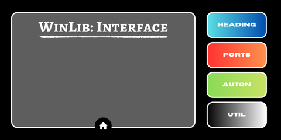
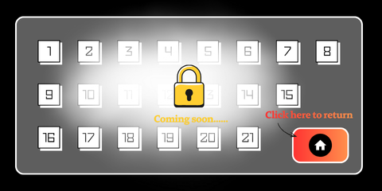
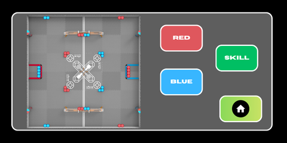
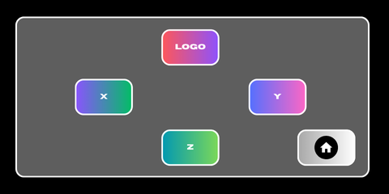
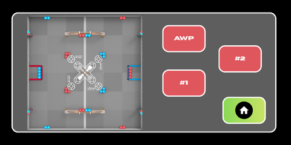
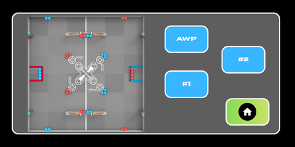
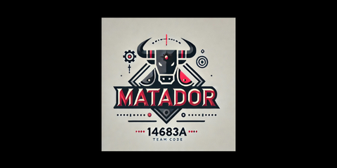

# WinLib Interface Class (WLIC)

A powerful C++ framework for building customizable touch-based graphical interfaces on VEX V5 Brain screens.


## 📋 Overview

WinLib Interface Class (WLIC) is a flexible GUI framework designed for VEX Robotics teams who want to create professional, interactive interfaces on their robot's brain screen. Build custom menus, navigation systems, and dynamic displays with ease.

### Key Features

✅ **Hierarchical Navigation** - Create multi-level menu systems with parent-child relationships

✅ **Touch Detection** - Automatic button press detection with coordinate-based hit testing

✅ **Background Updates** - Run continuous update tasks for dynamic displays

✅ **RLE Image Support** - Efficient Run-Length Encoded image rendering

✅ **Callback System** - Execute custom actions on button presses

✅ **State Management** - Clean interface activation and deactivation

## 🚀 Quick Start

### Prerequisites

- VEX V5 Brain
- VEXcode Pro V5 (C++)
- VEX SDK (V5_20240802_15_00_00 or newer)

### Installation

1. **Clone this repository:**
   ```bash
   git clone https://github.com/WinYeh/WinLib_InterfaceClass.git
   cd WinLib_InterfaceClass
   ```

2. **Open in VEXcode:**
   - Open VEXcode Pro V5
   - File → Open Project
   - Select the project folder

3. **Build and Download:**
   - Click the Build button
   - Connect your V5 Brain
   - Download to robot

## 🏗️ Project Structure

```
WinLib_InterfaceClass/
├── include/
│   ├── WLIC.h              # Interface class header
│   ├── vex.h               # VEX includes and macros
│   └── robot-config.h      # Robot hardware configuration
├── src/
│   ├── WLIC.cpp            # Interface implementation
│   ├── main.cpp            # Competition template
│   └── robot-config.cpp    # Hardware initialization
├── vex/                    # VEX SDK files
├── .vscode/                # VSCode configuration
├── assets/                 # Interface screenshots and images
├── makefile                # Build configuration
├── API_Reference.md        # Complete API documentation
├── README.md               # This file
├── LICENSE                 # MIT License
└── .gitignore              # Git ignore rules
```

## 🎨 Built-in Interfaces

WLIC comes with a complete set of pre-built interfaces to help VEX Robotics teams quickly create professional, customizable screens for their robots. These interfaces demonstrate the framework's capabilities and serve as templates that you can modify for your own needs.

### Interface Hierarchy

The built-in interfaces are organized in a hierarchical navigation structure:

#### Layer 1: Main Menu

**Home Interface** - The primary landing screen displayed when the program starts



From the Home screen, users can navigate to four different interfaces:

#### Layer 2: Main Features

**Heading Interface** - Visual compass display showing robot orientation


**Ports Interface** - Motor and sensor port status display



**Auton Select Interface** - Autonomous routine selection menu



**Utilities Interface** - Additional tools and settings



#### Layer 3: Sub-Menus

**Auton Red** - Red alliance autonomous routine options (accessed from Auton Select)



**Auton Blue** - Blue alliance autonomous routine options (accessed from Auton Select)



**Logo** - Team branding display (accessed from Utilities)



### Customization

All built-in interfaces can be customized or used as templates for your own designs:

- Modify button layouts and coordinates
- Change colors and graphics
- Add your team's branding
- Create new interfaces following the same patterns
- Link interfaces to build your own navigation hierarchy

See the [API Reference](API_Reference.md) for detailed documentation on creating and customizing interfaces.

## 🐛 Troubleshooting

### Interface doesn't respond to touches
- Verify button coordinates are correct
- Check that `activate()` is called in main loop
- Ensure `Interface::reset()` is called after activate

### Screen doesn't clear when navigating
- Make sure linked interfaces are properly set up
- Verify child interface is in the `activate()` loop

### Multiple interfaces activate simultaneously
- Only one interface should have `index == -1`
- Ensure `Interface::reset()` is called regularly

## 📝 License

This project is licensed under the MIT License - see the [LICENSE](LICENSE) file for details.

## 👥 Authors

- **Win Yeh** - *Initial work*

## 🙏 Acknowledgments

- VEX Robotics for the V5 platform
- [VEX Image Converter](https://suhjae.github.io/vex-image/) by suhjae
- VEX community for feedback and testing

## 📚 Documentation

For complete API documentation, detailed examples, and step-by-step guides on creating custom interfaces, please refer to the **[API Reference](API_Reference.md)**.

The API Reference includes:
- Complete constructor documentation with examples
- Step-by-step guide for creating custom interfaces using Canva
- Button coordinate system with ruler instructions
- Interface hierarchy and navigation system explanation
- All public methods and usage examples
- VEX Screen API reference

## 📊 Project Status

**Status:** Active Development
**Version:** 1.0.0
**Last Updated:** October 2025

---

Made with ❤️ for VEX Robotics teams worldwide
